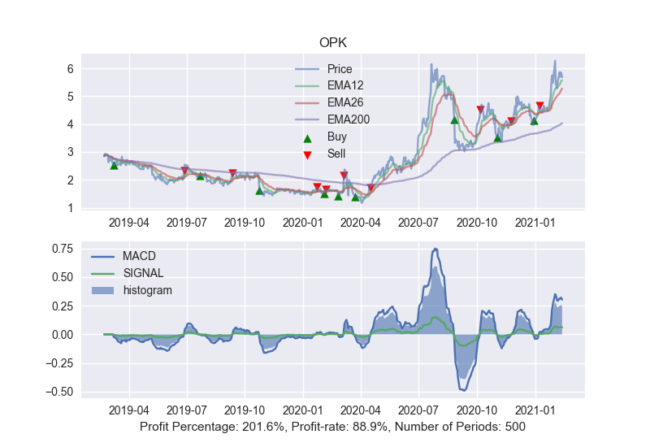
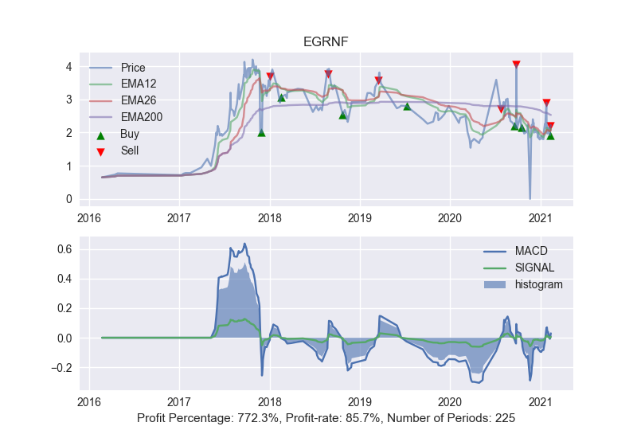
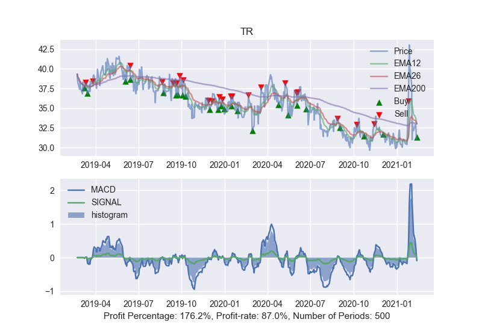
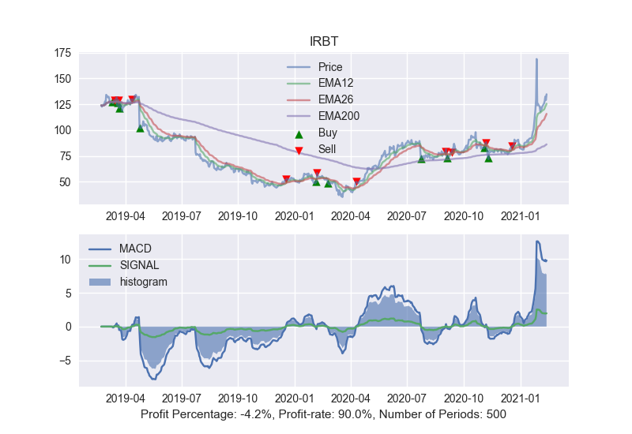
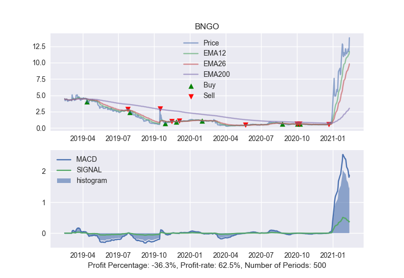

# Trading Bot
Python program that uses a simple MACD-indicator to determine when to sell and buy stocks. :chart_with_upwards_trend:

## Backtesting
Backtesting on old data is used to analyse the efficiency of the algoritm. This data is retrived through the [IEX Cloud](https://iexcloud.io/) REST-api.

***DISCLAMER:***
* The data used is not true histoical data, but still resembles real stock movements.
* Commission is not taken into account with the current model.

#### Examples of profitable results:

#### Examples of less profitable results:

